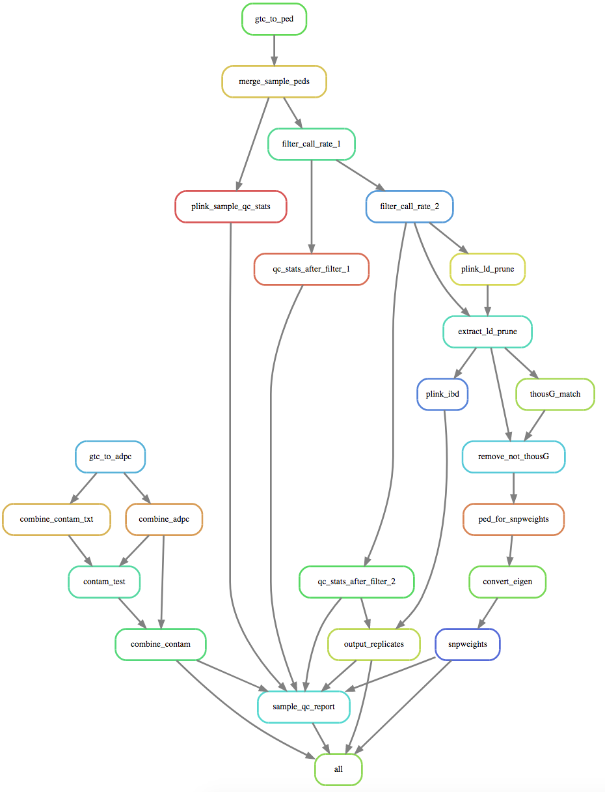

[](https://storage.googleapis.com/cgr_gwas_qc_docs/html/index.html)


[](https://www.python.org/)
[](https://www.sphinx-doc.org/)
[](https://snakemake.readthedocs.io)
[](https://github.com/psf/black)
[](https://github.com/snakemake/snakefmt)
[](https://github.com/pre-commit/pre-commit)


# GwasQcPipeline
QC pipeline for Illumina SNP Array data generated at CGR

A stable version of this repo exists on cgemsiii here:
/DCEG/CGF/Bioinformatics/Production/software/GwasQcPipeline/



## How to run the pipeline with the wrapper script:

```
./GwasQcWrapper.py -h
usage: GwasQcWrapper.py [-h] [-p PATH_TO_PLINK_FILE] [-d DIRECTORY_FOR_OUTPUT]
                        [--snp_cr_1 SNP_CR_1] [--samp_cr_1 SAMP_CR_1]
                        [--snp_cr_2 SNP_CR_2] [--samp_cr_2 SAMP_CR_2]
                        -s SAMPLE_SHEET
                        [--subject_id_to_use SUBJECT_ID_TO_USE]
                        [--lims_output_dir LIMS_OUTPUT_DIR]
                        [--contam_threshold CONTAM_THRESHOLD]
                        [-i ILLUMINA_MANIFEST_FILE]
                        [-u]

Required Arguments:
  -s SAMPLE_SHEET, --sample_sheet SAMPLE_SHEET
                        Full path to illimina style sample sheet csv file.


Exactly one of these arguments is required:
  -p PATH_TO_PLINK_FILE, --path_to_plink_file PATH_TO_PLINK_FILE
                        Full path to either PLINK ped or bed to use as input.
  -g GTC_DIR, --gtc_dir GTC_DIR
                        Full path to gtc directory to use instead of project
                        directory in SAMPLE_SHEET, which is the Default. Will recursively find
                        gtc files in this directory.


Required arguments with Default settings:
  -i ILLUMINA_MANIFEST_FILE, --illumina_manifest_file ILLUMINA_MANIFEST_FILE
                        Full path to illimina .bpm manifest file. Required for
                        gtc files. Default to /DCEG/CGF/Infinium/Resources/Manifests/GSAMD-Files/build37/GSAMD-24v1-0_20011747_A1.bpm
  -d DIRECTORY_FOR_OUTPUT, --directory_for_output DIRECTORY_FOR_OUTPUT
                        REQUIRED. Full path to the base directory for the GWAS
                        QC pipeline output. Defaults to
                        /DCEG/CGF/GWAS/Scans/GSA_Lab_QC/SR#/builds/QC_v#_date

  --subject_id_to_use SUBJECT_ID_TO_USE
                        Name of column in sample sheet that corresponds to
                        subject ID to use. Defaults to "LIMS_Individual_ID"
  -a ADPC_FILE, --adpc_file ADPC_FILE
                        Full path to adpc.bin file. Required for PLINK input for contamination check.
  --snp_cr_1 SNP_CR_1   REQUIRED. SNP call rate filter 1. Default= 0.80
  --samp_cr_1 SAMP_CR_1
                        REQUIRED. Sample call rate filter 1. Default= 0.80
  --snp_cr_2 SNP_CR_2   REQUIRED. SNP call rate filter 2. Default= 0.95
  --samp_cr_2 SAMP_CR_2
                        REQUIRED. Sample call rate filter 2. Default= 0.95
  --ld_prune_r2 LD_PRUNE_R2
                        REQUIRED. r-squared cutoff for ld pruning of SNPs to
                        use for IBD and concordance. Default= 0.10
  --maf_for_ibd MAF_FOR_IBD
                        REQUIRED. MAF cutoff of SNPs to use for IBD and
                        concordance. Default= 0.20
  --ibd_pi_hat_cutoff IBD_PI_HAT_CUTOFF
                        REQUIRED. PI_HAT cutoff to call samples replicates.
                        Default= 0.95
  --dup_concordance_cutoff DUP_CONCORDANCE_CUTOFF
                        REQUIRED. SNP concordance cutoff to call samples
                        replicates. Default= 0.95
  --lims_output_dir LIMS_OUTPUT_DIR
                        REQUIRED. Directory to copy QC file to upload to LIMS
                        Default to /DCEG/CGF/Laboratory/LIMS/drop-box-prod/gwas_primaryqc
  --contam_threshold CONTAM_THRESHOLD
                        REQUIRED. Cutoff to call a sample contaminated.
                        Default= 0.10
  -q QUEUE, --queue QUEUE
                        REQUIRED. Queue on cgemsiii to use to submit jobs.
                        Defaults to all of the seq queues and all.q if not
                        supplied. Default="all.q,seq-alignment.q,seq-calling.q
                        ,seq-calling2.q,seq-gvcf.q"


Optional arguments:
  -h, --help            show this help message and exit

  -u, --unlock_snakemake
                        OPTIONAL. If pipeline was killed unexpectedly you may
                        need this flag to rerun
```
