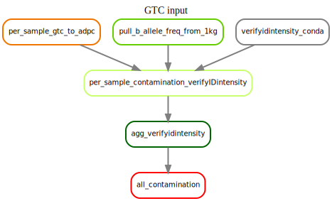
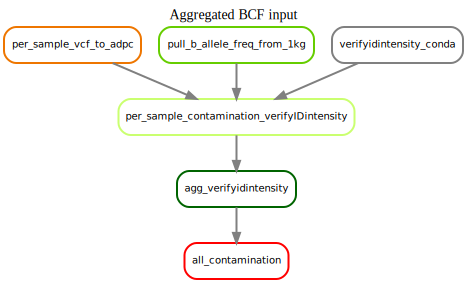

.. _contamination:

Contamination Sub-workflow
==========================

**Workflow File**:
   https://github.com/NCI-CGR/GwasQcPipeline/blob/default/src/cgr_gwas_qc/workflow/sub_workflows/contamination.smk

**Major Outputs**:

   - ``sample_level/<BPM Prefix>.<software_params.contam_population>.abf.txt`` B allele frequencies from the 1000 genomes.
   - ``sample_level/contamination/verifyIDintensity.csv`` aggregated table of contamination scores.

**Config Options**: see :ref:`config-yaml` for more details

   - ``reference_files.thousand_genome_vcf``
   - ``reference_files.thousand_genome_tbi``
   - ``user_files.bcf`` or ( ``reference_files.illumina_manifest_file`` and ``user_files.gtc_pattern`` )
   - ``software_params.contam_population``

|bcf_input_contamination| |gtc_input_contamination|

The contamination sub-workflow.
This workflow will estimate contamination using verifyIDintensity on each sample individually.
It requires that you have aggregated BCF or GTC files.
It first pulls B-allele frequencies from the 1000 Genomes VCF file.
It then estimate contamination for each sample and aggregates these results.
