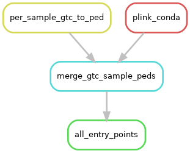

.. _entry-points:

Entry Points Sub-workflow
=========================

**Workflow File**:
   https://github.com/NCI-CGR/GwasQcPipeline/blob/default/src/cgr_gwas_qc/workflow/sub_workflows/entry_points.smk

**Config Options**: see :ref:`config-yaml` for more details

   - ``user_files.gtc_pattern``
   - ``user_files.idat_pattern``
   - ``user_files.ped``
   - ``user_files.map``
   - ``user_files.bed``
   - ``user_files.bim``
   - ``user_files.fam``
   - ``user_files.bcf``

**Major Outputs**:

   - ``sample_level/samples.bed``
   - ``sample_level/samples.bim``
   - ``sample_level/samples.fam``

The pipeline is an end-to-end workflow. It can accept raw IDAT files and generate a QC report. However, it can also continue from various other stages in analysis such as per-sample GTC files or an aggregated dataset file:

**per-sample IDAT files**:
Given ``user_files.idat_pattern`` and ``workflow_params.convert_idat2gtc=true``, it would use the Illumina's dragen array software to convert idats to gtcs and subsequently convert gtcs to aggregated BED/BIM/FAM.
To start with idat files, a cluster egt file using ``reference_files.illumina_cluster_file`` must be provided and dragen array sofware should be accesible either as module or a path provided using ``workflow_params.dragena_location``

**per-sample GTC files**:

The pipeline supports two different methods for converting per-sample GTCs to aggregated BED/BIM/FAM:

1. If GTC files are provided using ``user_files.gtc_pattern`` and ``workflow_params.convert_gtc2bcf=false`` (default) then following rulegraph will be followed:

   The entry-point workflow with GTCs and ``convert_gtc2bcf=false``.
   If per sample GTC files are provided and convert_gtc2bcf is false, then we will convert these files to the PED/MAP format and merge them together.

2. If GTC files are provided using ``user_files.gtc_pattern`` and ``workflow_params.convert_gtc2bcf=true`` then the following rulegraph will be followed:

   The entry-point workflow with GTCs and ``convert_gtc2bcf=true``.
   If per sample GTC files are provided and convert_gtc2bcf is true, then we will convert these files to an aggregated BCF file and load the BCF file into Plink to create a BED/BIM/FAM set.

**Aggregated dataset**:

If a reanalysis for previous dataset is desired or GTC files are unavailable, an aggregated file encoding genotypes for all samples can be provided. The pipeline currently supports following three aggregated file formats:

1. If an aggregated PED/MAP is provided using ``user_files.ped`` and ``user_files.map`` then we will convert the PED/MAP to BED/BIM/FAM.
2. If an aggregated BED/BIM/FAM is provided using ``user_files.bed``, ``user_files.bim``, ``user_files.fam`` then we will create a symbolic link.
3. If an aggregated BCF file is provided using ``user_files.bcf`` then we will convert the BCF to BED/BIM/FAM.
