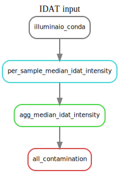
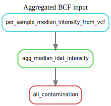

.. _intensity:

Intensity check Sub-workflow
============================

**Workflow File**:
   https://github.com/NCI-CGR/GwasQcPipeline/blob/default/src/cgr_gwas_qc/workflow/sub_workflows/intensity_check.smk

**Config Options**: see :ref:`config-yaml` for more details

   - ``user_files.bcf`` or ``user_files.idat_pattern``

**Major Outputs**:

   - ``sample_level/contamination/median_idat_intensity.csv`` aggregated table of median IDAT intensities.

|bcf_input_intensity| |idat_input_intensity|

The Intensity check sub-workflow.
This workflow will calculate the median intensity for each sample individually.
It requires that you have an aggregated BCF or IDAT files.
